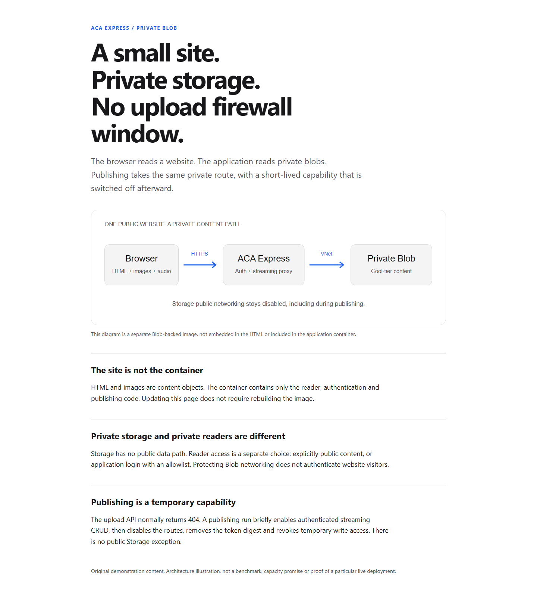

# A small site, private storage

A neutral site demonstrating the separation between an application container
and Blob-backed content. The HTML references a separate SVG image; neither asset
belongs in the runtime image.

Open [site/index.html](site/index.html) locally to inspect the content. The
[diagram](site/images/content-path.svg) is an original illustration. The local
preview works without JavaScript and does not require an Azure account.

## Example prompt

> Publish this small site on ACA Express in Sweden Central. Put its HTML and
> images in Cool-tier Blob Storage that never has public networking enabled.
> Use VNet integration, a Blob private endpoint and private DNS. Scale on HTTP
> from zero to one replica. Publish through a temporary authenticated upload
> API, disable it afterward, then protect readers with Entra and an explicit
> allowlist.

## Deployment evidence

The live Azure deployment was checked separately from the local preview:

| Check | Observed result |
| --- | --- |
| Hosting model and region | Express environment successfully deployed in Sweden Central |
| VNet integration | Environment attached to the delegated application subnet |
| Blob public network | Disabled |
| Anonymous and shared-key access | Both disabled |
| Storage account tier | Cool |
| Blob private endpoint | Approved |
| Private DNS | Resolution from inside the running application returned the private endpoint's VNet address |
| Runtime Blob role | Reader at the exact content-container scope |
| Persisted content tiers | Direct SDK inspection inside the application confirmed Cool on both HTML and SVG |
| Container build | ACR built the locked runtime using the approved package feed; deployment uses an image digest |
| Example rendering | Live Blob-backed HTML and separate image passed light/dark and mobile/desktop checks with JavaScript disabled |
| Publishing | HTML and SVG uploaded through the authenticated relay, without opening Storage networking |
| Publishing authorization | Missing, wrong, and digest-as-token credentials rejected |
| CRUD and pagination | Create/read/overwrite/exact-delete passed; 102 test objects traversed across multiple pages |
| Conditional writes | Failed overwrite precondition preserved the committed object |
| Large content | 64 MiB upload/download returned the same SHA-256; HEAD, range 206 and invalid-range 416 passed |
| Closed publishing | List, GET, HEAD, PUT and DELETE returned 404; temporary Contributor revoked, Reader retained |
| Scaling | HTTP min-0/max-1 configuration verified; zero replicas observed before a successful HTTP wake-up |
| Reader identity registration | Single-tenant Entra application and service principal created for the actual callback |
| Entra protocol checks | Live tenant-specific redirect, actual callback/client, code flow, state/nonce/PKCE and secure cookie checked; invalid callback rejected |
| Allowed-user sign-in | A real allowlisted user completed fresh Entra sign-in and confirmed the site works |
| Reader protection | Anonymous root, HTML, SVG, HEAD and range requests blocked; direct public Blob request denied |

Real **denied-user sign-in remains unverified** because a second interactive
account was not available. Local mocked-provider tests cover denial, but are
not a substitute for a live account check.

To check the image in an authenticated browser, open Developer Tools, select
Network, disable the browser cache, and reload. `images/content-path.svg`
should be a separate **200** response with `Content-Type: image/svg+xml`.
Open that relative URL directly in the same signed-in browser to inspect it.
The application image contains only server code: the HTML uses an external
`img` reference and the reader fetches its content through the private Blob SDK.
A direct public Storage URL should fail; the browser uses the authenticated
application URL, not a Blob URL.

The preview exposed two practical integration issues. An ARM configuration
update could succeed while the running process retained old environment values;
the scripts now use configuration-preserving updates and application stop/start,
then check real HTTP behavior. Standard revision restart/log tooling was not
reliable for this Express deployment. On Windows, redirected ACR progress logs
also required an explicitly UTF-8 Azure CLI launcher. Neither issue was resolved
by weakening Storage networking or switching to standard ACA.

Entra discovery also required honoring the platform's CA configuration in the
OAuth HTTP client. The deployed fix preserves TLS certificate verification.
Temporary test objects were deleted; only the example content remains.

## Reproduce

Use the [skill's deployment and publishing commands](../../skills/aca-web-publish/README.md).
Publish only the `site` directory. Configure reader authentication before
uploading private content; an explicitly public demonstration requires the
publisher's `-AllowAnonymous` switch.

No live tenant, user, application or resource IDs are embedded in this example.
Use your own authorized subscription and identities. The resource group and
identity registration have separate lifecycles; retiring either requires an
explicit decision. Scale-to-zero does not eliminate private endpoint, registry,
DNS or Storage charges.
