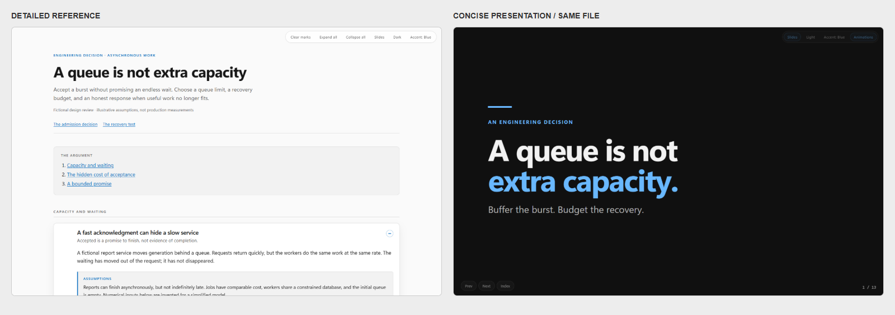

# A queue is not extra capacity

An original fictional engineering talk: **one HTML file for presenting live and
reading the details afterward**. Three chapters, eight cards, seven deeper
reveals, and an inline theme/accent-aware diagram. The presentation follows
those same chapters and cards, but uses **short speaker cues instead of the
reading paragraphs**. A designed opening and closing complete thirteen slides.

[](queue-is-not-capacity.standalone.html)

Browser screenshots: reading on the left, presenting on the right.

## Open it

1. Click [the standalone HTML](queue-is-not-capacity.standalone.html).
2. On GitHub, choose **Download raw file**. A GitHub file preview shows source;
   it does not run the presentation. Save the `.html` file, not the GitHub page.
3. Open the downloaded file in a modern browser. No server, account, Node.js,
   network connection, or neighboring assets are needed.
4. Click **Slides** to present. Afterward, send that exact file to listeners:
   they can turn slides off and expand the explanation under each point.

If you cloned the repository, open either the standalone above or the
[editable source](queue-is-not-capacity.html). The source links to
`../../skills/html-docs/assets`; downloading it alone is not enough.

### Controls

- **Reading:** click a card title to expand it; click a reveal for deeper
  reasoning. **Expand all / Collapse all** affect cards, not nested reveals.
- **Presentation:** **Slides** toggles views; `Escape` returns to reading.
  `Right` / `Space` advance points, then slides; `Left` reverses.
  `PageDown` / `PageUp` always skip whole slides.
  `Home` / `End` jump to the ends. **Index** or `O` jumps to a slide.
- **Full screen:** `F` while presenting. Click a non-control area to advance,
  or swipe horizontally on touch.
- **Theme:** **Dark / Light** switches the whole document and diagram.
- **Accent:** cycles blue, orange, green. Only one accent is used at a time,
  alongside black, white, and grayscale; the default is blue.
- **Animations:** or `A` toggles stepwise cues. Reduced motion shows all points
  without animation. Presentation surfaces contain no reveals or tabs.
- **Read marks:** stored only in the local browser; **Clear marks** resets them.

Theme, accent, and animation choices stay local and are scoped to this
document. You can append `?view=slides` or
`?view=slides&theme=dark&accent=orange#card-premise` to a local HTML URL.
Without JavaScript, the complete article and all reveals remain readable;
interactive presentation controls require JavaScript.

## Exact generation prompt

> Use html-docs to create an original, polished, fictional engineering talk
> titled “A queue is not extra capacity.” Make it one article with slides mode:
> the live presentation and the detailed follow-up must use the same chapters
> and cards in the same order, with deeper reasoning in reveals. Deliberately
> separate the surfaces: slides support a speaker with one claim and at most
> three short points, never reading paragraphs or interactive controls.
> Author a polished opening and a memorable final-message slide. Use three
> chapters and eight cards, with explanatory prose in the reading bodies.
> Explain completion capacity, recovery
> headroom, queue age, retries, bounded admission, terminal job outcomes, and
> testing the drain path. Use black, white, grayscale and one accent at a time:
> blue by default, with orange/green alternatives through the shared controls.
> Include a simple inline SVG that follows both theme and accent. Use tasteful
> optional point-by-point builds that respect reduced motion. State the
> assumptions explicitly. A worked burst may assume 120 jobs/second arriving
> for 30 seconds, 80 jobs/second completion capacity, and 40 jobs/second arrivals
> afterward; label these as invented inputs, never production metrics.
> Use explanatory prose, no meta narration, no private workplace content,
> no external assets, and no unverifiable benchmark claims. Save the editable
> source as examples/html-docs/queue-is-not-capacity.html, linking to
> ../../skills/html-docs/assets. Include the MIT notice. Build
> queue-is-not-capacity.standalone.html in the same folder so I can present and
> share that one file. Validate source and isolated export in a real browser,
> all six theme/accent combinations and slides, at laptop and projector sizes,
> including keyboard controls, offline and JavaScript-disabled reading.
> Inspect the screenshots and create a representative paired PNG preview.

## Rebuild

Edit the linked source, not the generated `.standalone.html`. From the
repository root, with Node.js installed:

```powershell
node skills\html-docs\assets\sync-head.js examples\html-docs\queue-is-not-capacity.html
node skills\html-docs\assets\bundle.js examples\html-docs\queue-is-not-capacity.html
```

For browser validation, additionally provide Playwright and Chromium or a
compatible installed browser:

```powershell
node skills\html-docs\assets\validate.js examples\html-docs\queue-is-not-capacity.html
```

Follow [the validation guide](../../skills/html-docs/references/validation.md)
to check the export in isolation and inspect all six palettes. None of
these authoring tools are required by recipients.
